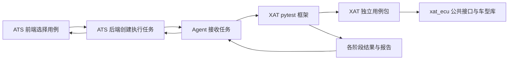

# XAT 框架、库、用例与 ATS 调用

集成落点是本 ATS 仓库内的 `xat`。原 SAT 与 ECU Simulator 的源码能力已经迁入，各自拥有独立职责和开发目录。原仓库保留用于来源核对，不参与运行或安装。

## 调用关系



框架负责 pytest 收集、选择、fixture 生命周期、结果与报告。库负责协议、传输、设备与业务能力，不导入框架或用例。用例通过 `xat_ecu.api`、`VehicleSDK` 等公开接口访问库；框架可为设备 fixture 延迟加载库，并通过可注入 reporter 把库步骤接入 Allure。库可在没有 pytest、ATS 后端或用例包的环境中单独安装。

## 安装与软件验证

在 ATS 根目录执行：

```bash
python -m venv .venv-integration
.venv-integration/bin/python -m pip install -r requirements-integration.txt
.venv-integration/bin/python -m pip install -e './xat/packages/ecu[test,protocols]'
.venv-integration/bin/python -m framework --mode offline --output-dir /tmp/xat-results
```

按能力单独安装库的 `[can]`、`[ssh]`、`[serial]`、`[security]`、`[network]`、`[protocols]`。台架业务仍需原厂驱动、对应系统 ABI、私有平台包及用户配置；这些不在软件验收中连接或运行。

库测试可独立运行：

```bash
python -m pytest xat/packages/ecu/tests --noconftest -q
```

框架独立安装和生命周期验证不要求 ECU 库：

```bash
python -m pip install -e ./xat
PYTHONPATH=xat python -m pytest tests/test_automotive_lifecycle.py --noconftest -q -o addopts=''
```

原车辆用例仅进行静态编译检查，不能使用全量 pytest 命令执行。`scripts/check_software.sh` 只运行已列明的软件检查。`scripts/audit_xat_sources.py` 检查源码可编译、库反向依赖和缺失本地导入，发现问题会返回失败。

## Agent 与前端

Agent 配置采用 `integrations.xat`，示例见 `agent/config.sat.yaml.example`。`root` 是 XAT 用例和配置的资源根目录，`python` 指向已安装框架及库的解释器，`allow_hardware` 默认 false。旧 `integrations.sat` 只保留解释器和开关兼容，不加载旧仓库。

前端模板使用 `xat --mode offline`；兼容旧的 `ats-sat` 命令。框架接受 `--selection` 用例选择文件、`--bench-config` 与 `--case-config` 配置文件，Agent 为每次 execution_id 创建独立目录。结果在 setup/call/teardown 完成后写入，清理失败或选中的用例缺失不会返回成功。Agent 继续负责超时、进程组取消、重连补传和处理后 ACK 去重。

分布式部署的仓库地址由 `XAT_GIT_URL` 提供，使用 Git 凭证管理或 SSH，不在地址中内嵌密码。部署安装 XAT 自有框架、库和用例，不再拉取旧 SAT 仓库。监控与设备锁脚本来自框架包内资源；这些设备命令仅做软件生成检查，未实际执行。

真实台架入口是 `xat --mode hardware`，需要额外显式允许。本次不启用，不执行台架用例、真实刷写或设备操作。

## 维护边界与迁移限制

- 框架修改提交在 `xat/framework`，库修改提交在 `xat/packages/ecu`，用例和输入数据提交在 `xat/cases`；各自有独立 GitHub 检查。
- 原代码的凭证改为环境变量注入。清单列出所需 `XAT_CREDENTIAL_*` 名称，未提供时明确报错；不在源码中恢复原凭证。
- 旧 CGW/Force 等工具的源项目缺少依赖，按用户选择保留在 `xat/tools/archive/ecu`，归档及缺失引用见 `docs/migration/历史工具归档.json`。
- 现代 `VehicleSDK.flash` 原本是假成功占位，已改为明确拒绝。原实际刷写实现已保留在 `xat_ecu.legacy.ecu_sim.sd_tester`，未执行刷写验收。
- 软件测试验证已覆盖的协议、配置、模拟、生命周期和任务回填；不证明全部车型或原生驱动在真实硬件上可用。

来源、当前阶段和验收记录见 [XAT 功能迁移](XAT功能迁移.md) 与 [开发验收日志](开发验收日志.md)。
